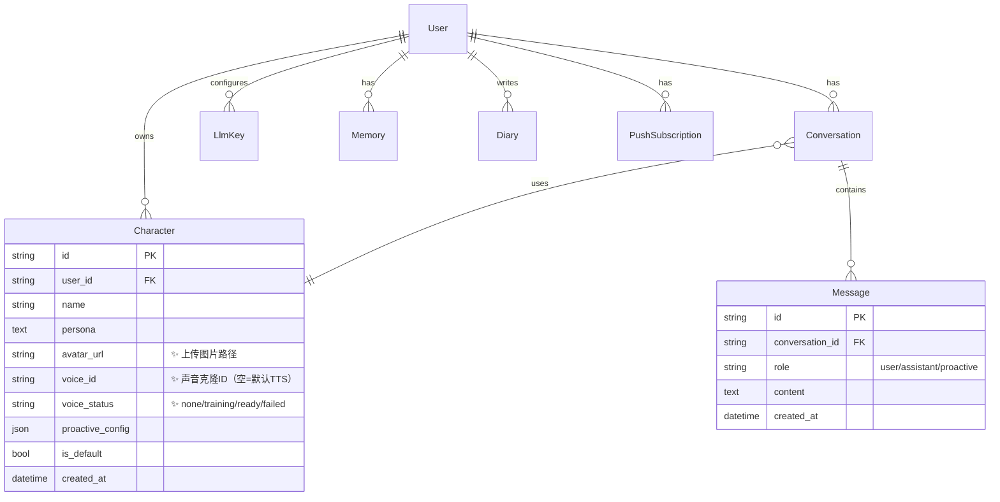

# 架构方案: 伴语 (Banyu) v2

> 主动式 AI 陪伴产品。v2 新增语音电话、角色形象/声音上传、二次元 UI 重做。
> 本地优先：SQLite + 本地文件存储，不用云服务器。

---

## 1. 技术栈

| 层级 | 选型 | 理由 |
|------|------|------|
| 前端 | Next.js 16 (App Router) + TS + Tailwind 4 + Zustand | 已有基础，App Router + PWA |
| 后端 | FastAPI (Python) + SQLAlchemy async + aiosqlite | 已有基础，异步性能好 |
| LLM | 多 Provider 适配层（OpenAI/豆包/火山Coding/通义/DeepSeek/智谱） | 用户自带 key，模型列表过滤 |
| ASR | Web Speech API（浏览器内置） | 零成本，不需要后端处理音频 |
| TTS | Web Speech API（默认）+ 火山引擎 TTS（声音克隆） | 默认零成本，声音克隆需额外配置 |
| 实时通话 | WebSocket（FastAPI 原生支持） | 全双工通信，前端 VAD + 文字传输 |
| 文件存储 | 本地文件系统（server/uploads/） | 本地优先，不需要 OSS |
| 数据库 | SQLite（开发）-> Postgres（生产） | 零配置起步 |
| 主动陪伴 | APScheduler + Web Push | 已有基础 |

---

## 2. 目录分层（v2 新增标记 ✨）

```
banyu/
├── web/                          # Next.js 前端
│   ├── app/
│   │   ├── (app)/                # 主应用路由组
│   │   │   ├── chat/             # 对话页
│   │   │   ├── call/  ✨         # 实时通话页（全屏立绘）
│   │   │   ├── characters/       # 角色管理（含图片/语音上传）
│   │   │   ├── diary/            # 日记页
│   │   │   └── settings/         # 设置页
│   │   └── (auth)/               # 登录/注册
│   ├── features/
│   │   ├── chat/                 # 流式聊天
│   │   ├── voice/                # 语音输入/输出封装
│   │   ├── call/   ✨            # 实时通话组件（VAD + WebSocket）
│   │   ├── character/            # 角色卡组件
│   │   ├── upload/ ✨            # 图片/语音上传组件
│   │   ├── diary/                # 日记组件
│   │   └── push/                 # Web Push
│   └── lib/                      # API client、store、类型
├── server/                       # FastAPI 后端
│   ├── app/
│   │   ├── api/
│   │   │   ├── chat.py           # 流式对话 SSE
│   │   │   ├── voice_call.py ✨  # WebSocket 语音通话
│   │   │   ├── upload.py     ✨  # 图片/语音文件上传
│   │   │   ├── voice.py      ✨  # 声音克隆状态查询
│   │   │   ├── characters.py     # 角色 CRUD（增加图片/声音字段）
│   │   │   ├── llm_config.py     # key 配置/模型列表（增加过滤）
│   │   │   ├── memory.py         # 记忆管理
│   │   │   ├── diary.py          # 日记 CRUD
│   │   │   └── push.py           # Web Push
│   │   ├── models/
│   │   │   ├── character.py      # 增加 avatar_url, voice_id, voice_status
│   │   │   └── ...               # 其他模型不变
│   │   ├── services/
│   │   │   ├── llm/              # LLM 适配层（增加模型过滤）
│   │   │   ├── voice/        ✨  # 声音克隆 + TTS 服务
│   │   │   ├── memory/           # 记忆服务
│   │   │   ├── proactive/        # 主动陪伴
│   │   │   └── emotion/          # 情绪分析
│   │   ├── core/                 # 配置/鉴权/数据库/加密
│   │   └── main.py
│   └── uploads/              ✨  # 文件存储目录
│       ├── avatars/              # 角色头像/立绘
│       └── voices/               # 语音样本
```

---

## 3. 核心数据模型（v2 变更）



### Character 表 v2 新增字段
| 字段 | 类型 | 说明 |
|------|------|------|
| avatar_url | string | 上传图片的相对路径（如 `/uploads/avatars/xxx.jpg`） |
| voice_id | string | 声音克隆模型 ID（火山引擎返回），空表示用默认 TTS |
| voice_status | string | `none`（未上传）/ `training`（训练中）/ `ready`（就绪）/ `failed`（失败） |

---

## 4. 服务端边界

### 必须在服务端
- **鉴权**：JWT 签发/验证，密码 bcrypt
- **文件上传**：图片/语音文件接收、存储、大小校验
- **声音克隆**：调用火山引擎 TTS API 训练声音模型
- **LLM 调用**：API key 解密、流式调用、记忆注入
- **数据写入**：所有 ORM 写操作

### 可以在客户端
- **ASR**：Web Speech API 浏览器内置
- **TTS 播放**：Web Speech API 或调用后端 TTS API 获取音频
- **VAD**：语音活动检测（Web Audio API）
- **UI 状态**：聊天/通话模式切换、输入状态
- **文件预览**：上传前图片预览/语音试听

### WebSocket 语音通话流程
```
前端                          后端
  |                             |
  |--- WS connect ------------->|  建立连接
  |                             |
  |  （VAD 检测用户说话）         |
  |--- {type:"speech",          |  ASR 文字（前端 Web Speech API）
  |     text:"你好"} ---------->|
  |                             |
  |                             |  LLM 流式生成
  |                             |  TTS 文本 -> 音频
  |<-- {type:"token",           |  逐 token 推送（前端显示文字）
  |     text:"..."} ------------|
  |                             |
  |<-- {type:"audio_url",       |  TTS 音频 URL（前端播放）
  |     url:"..."} -------------|
  |                             |
  |  （TTS 播放完毕，继续听）     |
  |                             |
```

---

## 5. 声音克隆方案

### 依赖
- 火山引擎 TTS 服务（声音复刻 API）
- 需要火山引擎 TTS 的 access token（非 ARK LLM key）
- 若未配置 TTS token，降级为浏览器内置 TTS

### 流程
1. 用户上传 5-15 秒语音文件
2. 后端保存到 `uploads/voices/`
3. 后端调用火山引擎声音复刻 API，上传语音样本
4. API 返回 `voice_id`（声音模型 ID）
5. 存储 `voice_id` 到 Character 表，`voice_status = "ready"`
6. 后续 TTS 调用使用该 `voice_id`

### 降级策略
- 未配置 TTS token -> `voice_status = "none"`，用浏览器 TTS
- 训练失败 -> `voice_status = "failed"`，用浏览器 TTS + 错误提示

---

## 6. 模型列表过滤

### 过滤规则
```python
EXCLUDE_KEYWORDS = [
    "embedding", "vision", "image", "tts", "asr",
    "whisper", "clip", "multimodal", "rerank",
    "sd", "stable", "dall", "draw", "paint",
    "video", "code", "preview", "lite-i2v", "lite-t2v",
]

def filter_chat_models(models: list[str]) -> list[str]:
    return [
        m for m in models
        if not any(kw in m.lower() for kw in EXCLUDE_KEYWORDS)
    ]
```

### 输出示例
- 过滤前：`doubao-pro-32k, doubao-embedding-text, doubao-vision-pro, ...`
- 过滤后：`doubao-pro-32k, doubao-seed-1-6, deepseek-v4-flash, ...`

---

## 7. Protected Region（AI 不可覆盖）
- `server/app/services/llm/` - LLM 适配层核心逻辑
- `server/app/services/voice/` - 声音克隆逻辑
- `server/app/services/memory/extract.py` - 记忆提取 prompt
- `server/app/services/proactive/generator.py` - 主动消息生成
- `server/app/core/crypto.py` - 加密逻辑
- `server/app/services/character/default.py` - 默认角色人设

---

## 8. 变更记录
| 日期 | 变更内容 | 原因 |
|------|----------|------|
| 2026-08-08 | 初版架构 | vibe-plan 阶段3 |
| 2026-08-08 | v2 架构升级 | 语音电话 + 文件上传 + 声音克隆 + 模型过滤 |
