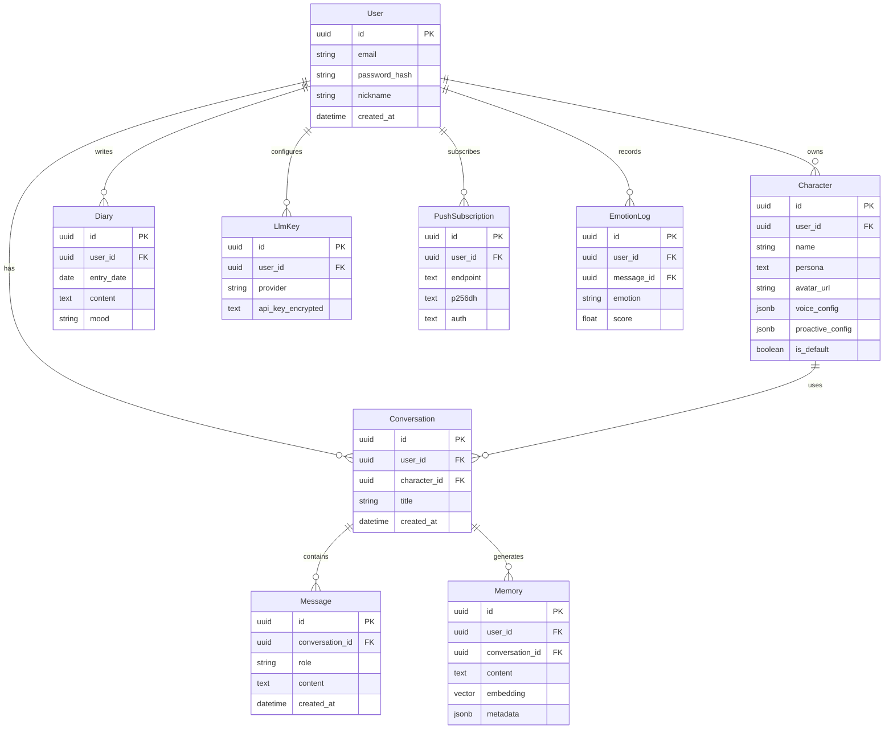

# 架构方案: 伴语 (Banyu)

> 主动式 AI 陪伴产品。前后端分离，多 LLM Provider 适配，Postgres+pgvector 长期记忆，定时+事件双触发主动陪伴。

---

## 1. 技术栈

| 层级 | 选型 | 理由 |
|------|------|------|
| 前端 | Next.js 14 (App Router) + TS + Tailwind + shadcn/ui + Zustand + PWA | SSR/SSG + PWA 可安装，shadcn/ui 快速 UI，后续 Capacitor/Tauri 复用同套 Web 代码 |
| 后端 | FastAPI (Python) | Python AI 生态顺，异步性能好，自动 OpenAPI 文档 |
| LLM | 多 Provider 适配层（OpenAI/豆包/通义/DeepSeek/智谱/Gemini） | 用户自带 key，`/models` 聚合返回可用模型，不锁厂商 |
| 数据库 | Postgres + pgvector | 关系数据 + 向量记忆一体，Neon/Supabase 免费起步 |
| 语音 | Web Speech API | 浏览器原生 ASR/TTS，MVP 零成本 |
| 主动陪伴 | APScheduler + Web Push | 后台定时调度 + 浏览器推送 |
| 部署 | Vercel(web) + 云服务器(FastAPI) + Neon(PG) | 前端边缘部署快，后端需常驻跑调度 |

---

## 2. 目录分层（按功能模块）

```
banyu/
├── web/                          # Next.js 前端
│   ├── app/
│   │   ├── (chat)/               # 对话页路由组（全屏沉浸）
│   │   ├── characters/           # 角色管理页
│   │   ├── diary/                # 日记页
│   │   ├── settings/             # 设置页（key/模型/通知/记忆）
│   │   └── api/                  # BFF 代理转 FastAPI
│   ├── features/                 # 功能模块
│   │   ├── chat/                 # 流式聊天 UI + Zustand 状态
│   │   ├── character/            # 角色卡组件
│   │   ├── diary/                # 日记组件
│   │   ├── voice/                # Web Speech 封装
│   │   └── push/                 # Web Push 订阅
│   ├── shared/                   # 共享 UI
│   └── lib/                      # API client、类型、常量
├── server/                       # FastAPI 后端
│   ├── app/
│   │   ├── api/                  # 路由层（薄）
│   │   │   ├── chat.py           # 流式对话 SSE
│   │   │   ├── characters.py     # 角色 CRUD
│   │   │   ├── memory.py         # 记忆查看/删除
│   │   │   ├── diary.py          # 日记 CRUD
│   │   │   ├── llm_config.py     # key 配置/模型列表
│   │   │   └── push.py           # Web Push 订阅
│   │   ├── models/               # SQLAlchemy ORM
│   │   ├── schemas/              # Pydantic schema
│   │   ├── services/             # 业务逻辑（核心，Protected）
│   │   │   ├── llm/              # LLM 适配层
│   │   │   │   ├── base.py       # Provider 抽象接口
│   │   │   │   ├── providers/    # openai/doubao/qwen/deepseek/zhipu/gemini
│   │   │   │   └── registry.py   # /models 聚合 + key 验证
│   │   │   ├── memory/           # 向量记忆提取/检索/注入
│   │   │   ├── proactive/        # 主动陪伴调度
│   │   │   ├── emotion/          # 情绪分析
│   │   │   └── voice/            # 语音适配（预留）
│   │   ├── core/                 # 配置/鉴权/数据库/加密
│   │   └── scheduler/            # APScheduler 入口
│   ├── alembic/                  # 迁移
│   └── tests/
├── docs/                         # PRD/架构/状态
└── references/                   # 视觉参考
```

---

## 3. 核心数据模型



**关键字段**：
- `Character.proactive_config` (jsonb)：主动触发配置（定时时段、问候类型、事件开关）
- `Memory.embedding` (vector)：pgvector 向量，检索 top-5
- `LlmKey.api_key_encrypted`：AES 加密，仅服务端解密
- `Character.is_default`：内置默认角色，不可删

---

## 4. 服务端边界

**必须在服务端**：
- 用户注册/登录（密码哈希、JWT 签发）
- LLM 调用（key 加密存储，服务端转发流式，绝不暴露 key 到前端）
- 主动陪伴调度（APScheduler 后台常驻，定时+事件触发）
- 向量记忆检索（pgvector 查询 + 提取/注入）
- 数据写入（角色/消息/日记/记忆/情绪，全经服务端）
- Web Push 推送（VAPID 私钥签名）
- API key 加解密

**可以在客户端**：
- UI 渲染、表单校验、输入控制
- 流式消息渲染（SSE 接收逐 token）
- Web Speech API 调用（浏览器原生 ASR/TTS）
- Web Push 订阅注册（前端拿 endpoint 提交后端）
- 非敏感数据缓存、乐观更新

**鉴权策略**：
- JWT + httpOnly Cookie（防 XSS 窃取 token）
- FastAPI 依赖注入校验当前用户
- API key 用户级 AES 加密，仅服务端解密调用 LLM

**LLM 适配层边界**（核心）：
- `services/llm/base.py` 统一接口：`chat_stream(messages, model) -> AsyncIterator[str]`、`list_models() -> list`、`embed(text) -> vector`
- 各 provider 适配器实现接口，抹平消息格式/流式协议差异
- `/models` 聚合用户已配置 key 下的可用模型
- 流式响应统一转 SSE，前端不感知 provider 差异

---

## 5. Protected Region（AI 不可覆盖）

| 文件 | 职责 | 保护理由 |
|------|------|----------|
| `server/app/services/llm/base.py` | Provider 抽象接口 | 契约层，影响所有适配器 |
| `server/app/services/llm/providers/*.py` | 各 provider 适配器 | 含 key 处理/流式协议，易错 |
| `server/app/services/memory/*.py` | 记忆提取/检索/注入 | 核心 RAG 逻辑 |
| `server/app/services/proactive/*.py` | 主动陪伴调度 | 触发逻辑复杂 |
| `server/app/core/auth.py` | 鉴权逻辑 | 安全关键 |
| `server/app/core/crypto.py` | API key 加解密 | 安全关键 |
| `web/features/chat/stream.ts` | 流式 SSE 处理 | 前端流式核心 |

---

## 6. 变更记录

| 日期 | 变更内容 | 原因 |
|------|----------|------|
| 2026-08-08 | 初版架构 | vibe-plan 阶段3 |
