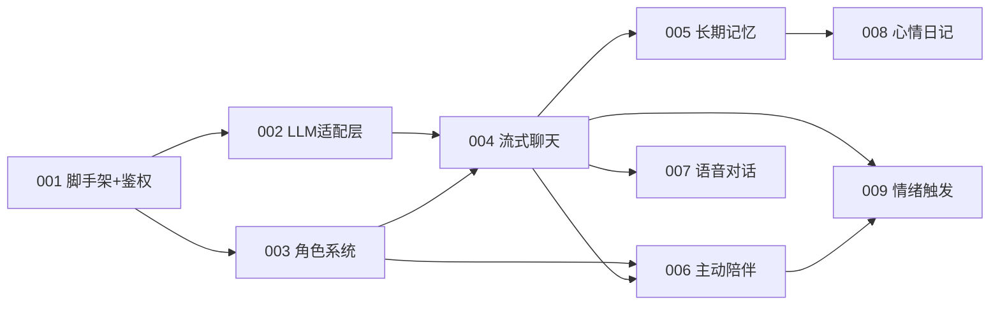

# 切片总览

> 伴语 (Banyu) P0 功能垂直切片。每个切片是端到端功能（DB -> API -> UI），可独立实现、可并行、可验证。

## 依赖图



## 切片列表

| 编号 | 名称 | 前置依赖 | 状态 | session-id | 分支 |
|------|------|----------|------|------------|------|
| 001 | scaffold-auth | 无 | ✅ 完成 | | slice/001-scaffold-auth |
| 002 | llm-adapter | 001 | ✅ 完成 | | slice/002-llm-adapter |
| 003 | character | 001 | ✅ 完成 | | slice/003-character |
| 004 | stream-chat | 002, 003 | ✅ 完成 | | slice/004-stream-chat |
| 005 | memory | 004 | ✅ 完成 | | slice/005-memory |
| 006 | proactive | 003, 004 | ✅ 完成 | | slice/006-proactive |
| 007 | voice | 004 | ✅ 完成 | | slice/007-voice |
| 008 | diary | 001, 005 | ✅ 完成 | | slice/008-diary |
| 009 | emotion | 004, 006 | ✅ 完成 | | slice/009-emotion |

## 起步路径

用户要求"角色系统 + 流式聊天"起步。由于这两者依赖基础设施，实际起步顺序：

```
001（脚手架+鉴权）
  └─> 002（LLM 适配层）┐
  └─> 003（角色系统）  ├─> 004（流式聊天）
                       ┘
```

- 001 完成后，002 与 003 可并行
- 004 依赖 002 + 003
- 005（长期记忆）/ 006（主动陪伴）spec 已补写（vibe-spec 阶段）
- 007-009（P1：语音/日记/情绪触发）spec 已补写，P0 全部完成

## 切片粒度

每个切片设计为一个人可在 1 小时内 review 完。切片间通过共享文件（router/config/registry）追加式协作，不重写已有内容。
