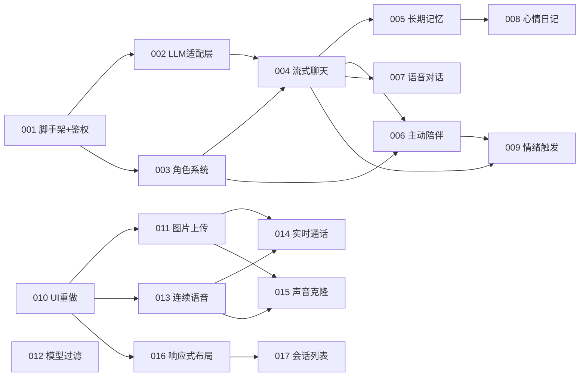

# 切片总览

> 伴语 (Banyu) 切片总览。001-009 已完成（P0+P1），010-015 为 v2 升级（语音电话+角色形象/声音+二次元UI），016-017 为 v3 响应式适配。

## 依赖图



## 切片列表

| 编号 | 名称 | 前置依赖 | 状态 | session-id | 分支 |
|------|------|----------|------|------------|------|
| 001 | scaffold-auth | 无 | ✅ 完成 | | slice/001-scaffold-auth |
| 002 | llm-adapter | 001 | ✅ 完成 | | slice/002-llm-adapter |
| 003 | character | 001 | ✅ 完成 | | slice/003-character |
| 004 | stream-chat | 002, 003 | ✅ 完成 | | slice/004-stream-chat |
| 005 | memory | 004 | ✅ 完成 | | slice/005-memory |
| 006 | proactive | 003, 004 | ✅ 完成 | | slice/006-proactive |
| 007 | voice | 004 | ✅ 完成 | | slice/007-voice |
| 008 | diary | 001, 005 | ✅ 完成 | | slice/008-diary |
| 009 | emotion | 004, 006 | ✅ 完成 | | slice/009-emotion |
| 010 | ui-redesign | 001-009 | ✅ 完成 | | slice/010-ui-redesign |
| 011 | avatar-upload | 010 | ✅ 完成 | | slice/011-avatar-upload |
| 012 | model-filter | 无 | ✅ 完成 | | slice/012-model-filter |
| 013 | voice-continuous | 010 | ✅ 完成 | | slice/013-voice-continuous |
| 014 | voice-call | 011, 013 | ✅ 完成 | | slice/014-voice-call |
| 015 | voice-clone | 011, 013 | ✅ 完成 | | slice/015-voice-clone |
| 016 | responsive-layout | 010 | ✅ 完成 | | slice/016-responsive-layout |
| 017 | chat-conversation-list | 016 | spec 就绪 | | slice/017-chat-conversation-list |

## v2 起步路径

```
010（UI重做 - 二次元暗色主题）
  ├─> 011（图片上传）┐
  └─> 013（连续语音）┘
                     ├─> 014（实时通话）
                     └─> 015（声音克隆）
012（模型过滤）- 独立，可并行
```

- 010 完成后，011/012/013 可并行
- 014 依赖 011（通话页展示立绘）+ 013（语音能力）
- 015 依赖 011（文件上传基础）+ 013（TTS 播放）

## v3 起步路径

```
016（响应式布局 - 侧边栏 + max-w 居中）
  └─> 017（聊天会话列表 - 桌面端会话侧栏）
```

- 016 完成后，017 开始
- 016 改动 11 个文件（CSS class 为主），017 新建 1 个组件

## 切片粒度

每个切片设计为一个人可在 1 小时内 review 完。切片间通过共享文件（router/config/registry）追加式协作，不重写已有内容。
